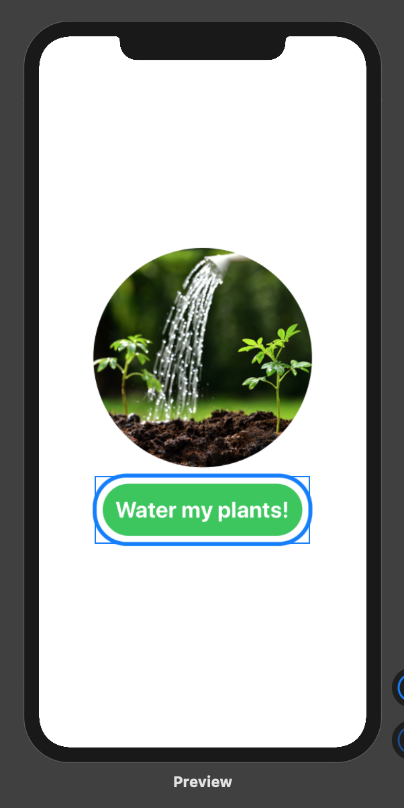

# WaterMyPlants
plant watering system

## App preview

## Raspberry-pi code

Follow the guide here, specifically Raspberry-pi and MQTT GPIO code integration

https://blog.devgenius.io/i-built-a-smart-irrigation-system-using-only-a-raspberry-pi-ba29282b499e

After the connection is properly established, the Swift code can be used to send signals to the Raspberry-pi module with the correct IP address

